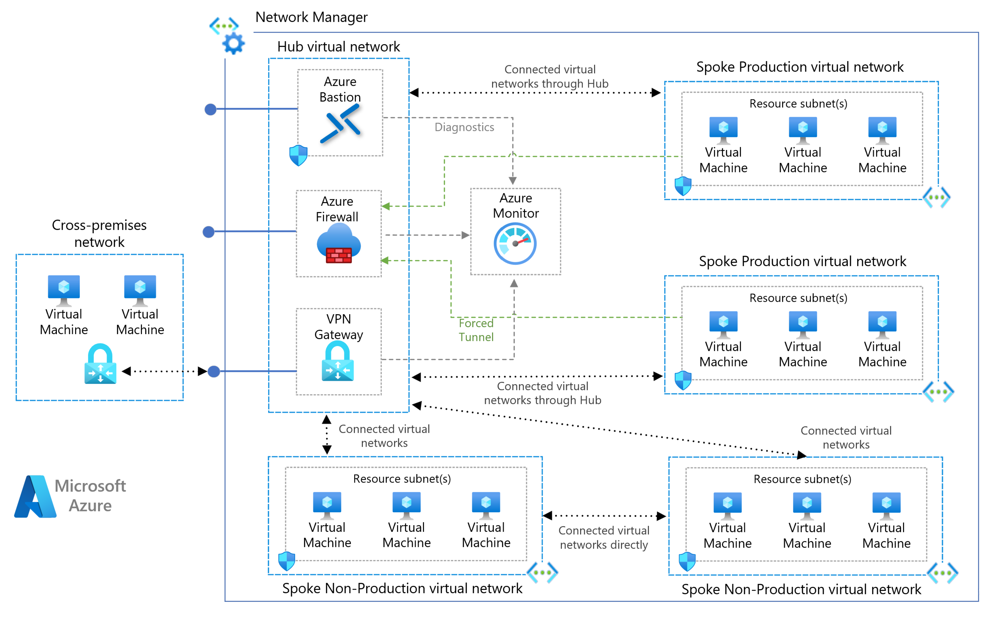

# Hub and spoke deployment with Mesh Connected Groups

This sample deploys Azure virtual networks, using Azure Virtual Network Manager to connect the virtual networks with a mesh topology connected group. The sample includes both hub and spoke virtual networks, which are all added to the same mesh. Note that gateway routes are not propagated with mesh connectivity, so deploying a Virtual Network Gateway in the hub with this pattern would require static routes. See [Quickstart: Create a mesh network topology with Azure Virtual Network Manager by using Bicep](https://learn.microsoft.com/azure/virtual-network-manager/create-virtual-network-manager-bicep) for more context.



## Deploy sample

**Default Deployment with Static Network Group Membership**

```bash
LOCATION=eastus
RESOURCEGROUP_NAME=rg-avnm-mesh-${LOCATION}

git clone https://github.com/Azure-Samples/avnm-mesh-connected-group

cd avnm-mesh-connected-group

az deployment sub create --template-file main.bicep -n avnm-mesh-connected-group -l ${LOCATION} --parameters resourceGroupName=${RESOURCEGROUP_NAME}
```

**Default Deployment with Dynamic Network Group Membership**

Include the deployment parameter `networkGroupMembershipType` with a value of `dynamic` to use Azure Policy to dynamically manage the membership of the network group.

> ![NOTE] This deployment requires permissions to create and assign Azure Policy at the target subscription level.

```bash
az deployment sub create --template-file main.bicep -n avnm-mesh-connected-group -l ${LOCATION} --parameters resourceGroupName=${RESOURCEGROUP_NAME} networkGroupMembershipType=dynamic
```

## Solution deployment parameters

| Parameter                    | Type   | Description                                                                      | Default                 |
| ---------------------------- | ------ | -------------------------------------------------------------------------------- | ----------------------- |
| `resourceGroupName`          | string | The resource group name where the AVNM and VNET resources will be created        |  null                   |
| `location`                   | string | Deployment location. Location must support availability zones.                   | `deployment().location` |
| `networkGroupMembershipType` | string | Specify either 'static' or 'dynamic' network group membership. Default: 'static' | `false`                 |

## Clean up

```bash
az group delete --name ${RESOURCEGROUP_NAME} --yes
```

## Microsoft Open Source Code of Conduct

This project has adopted the [Microsoft Open Source Code of Conduct](https://opensource.microsoft.com/codeofconduct/).

Resources:

- [Microsoft Open Source Code of Conduct](https://opensource.microsoft.com/codeofconduct/)
- [Microsoft Code of Conduct FAQ](https://opensource.microsoft.com/codeofconduct/faq/)
- Contact [opencode@microsoft.com](mailto:opencode@microsoft.com) with questions or concerns
